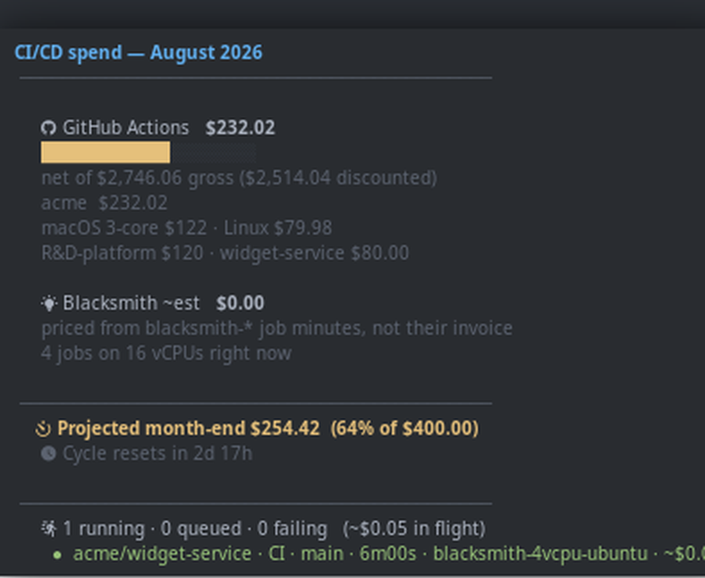

# cicdbar

> What your CI actually costs, in your status bar — GitHub Actions and Blacksmith, live.


[](https://github.com/jrosskopf/cicdbar/actions/workflows/ci.yml)
[](https://pypi.org/project/cicdbar/)
[](https://www.rust-lang.org/)
[](LICENSE)

A [waybar](https://github.com/Alexays/Waybar) module that turns CI minutes into
the number you actually care about: dollars. It reads GitHub's billing API and
[Blacksmith](https://blacksmith.sh)'s dashboard, shows what you have spent this
cycle and what you are on course to spend, and tells you what is running right
now — including what the job executing this second is costing you.

---

## Features

- **Real dollars, not minutes** — month-to-date spend straight from GitHub's
  billing API, reconciled against what they actually invoice
- **Blacksmith spend, priced per run** — the cost of the job running right now,
  which no generic CI widget can tell you
- **Live job status** — running, queued and failing, with elapsed time, branch
  and runner for each
- **Desktop notifications** — start and finish over D-Bus; one notification per
  run, updated in place rather than stacked
- **Projection, not just totals** — colour follows *projected* month-end spend
  against your budget, so a runaway shows on day 8 instead of at the invoice
- **Degrades honestly** — a failed fetch serves the last good value marked
  `⏸`; it never shows `$0.00` and lets you read that as good news
- **Cheap** — a warm tick costs zero requests, a cold one ~22, nearly all
  answered `304` and therefore free against your quota
- **One static binary** — musl, no runtime dependencies; `uvx cicdbar` to try
  it without installing anything

---

## Install

### Quickstart — no install required

```sh
uvx cicdbar --demo
```

That renders sample data offline, so you can see the output contract before
committing to anything.

### Arch (AUR)

```sh
paru -S cicdbar        # builds from source
paru -S cicdbar-bin    # prebuilt static binary
```

### uv

```sh
uv tool install cicdbar
```

### Prebuilt binary

Grab the static `x86_64` tarball from
[Releases](https://github.com/jrosskopf/cicdbar/releases) — no runtime
dependencies, drop it anywhere on `PATH`.

### From source

```sh
cargo build --release
cp target/release/cicdbar ~/.local/bin/
```

---

## Configure

```sh
mkdir -p ~/.config/cicdbar
cp config.example.toml ~/.config/cicdbar/config.toml   # then edit
```

You need a GitHub token with `repo` and `read:org` — **no billing scope**. By
default it reads the `gh` CLI's own token, so if `gh auth status` works, so
does this. You also need billing-read access to the orgs you list. Blacksmith
is optional; set `enabled = false` if you do not use it.

Then add the waybar module:

```json
"custom/cicdbar": {
    "exec": "cicdbar --format '{total_usd} · {run_glyph}{running} · {proj_pct}%{stale}'",
    "return-type": "json",
    "interval": 60,
    "tooltip": true,
    "on-click": "xdg-open https://github.com/organizations/<org>/settings/billing",
    "on-click-right": "xdg-open https://app.blacksmith.sh/<org>/usage"
}
```

Format placeholders: `{total_usd}` `{gh_usd}` `{bs_usd}` `{gross_usd}`
`{budget_usd}` `{proj_usd}` `{proj_pct}` `{cycle_reset}` `{running}`
`{queued}` `{failed}` `{inflight_usd}` `{run_glyph}` `{stale}`. An unknown
placeholder is an error rather than silent output, so a typo in your waybar
config is visible immediately.

---

## What you see

The bar carries total spend, a CI glyph (`✓` clean, `●` running, `◌` queued,
`✖` failing) with the running count, and projected month-end spend as a
percentage of budget.



Hovering expands it into per-org, per-SKU and per-repo spend, the projection,
and every run currently in flight with its elapsed time, runner and — for
Blacksmith runners — what it has cost so far.

*(Recordings use `--demo`, so the figures and repository names are synthetic.
`--demo 1..4` cycles the states shown above, which is also a quick way to check
your theme.)*

`--tooltip-only` prints the same thing as plain text, which is handy for
checking it in a terminal.

---

## Notifications

A desktop notification when a run starts and when it finishes, over D-Bus. A
run occupies **one** notification for its whole life: the "started" one is
replaced in place by its result rather than stacking a second.

The body carries what a generic CI notifier cannot — branch, duration, runner,
and for Blacksmith runs the estimated cost of that run:

```
✖ heron · Build failed
fix/worker-binary-race · 4m12s · blacksmith-4vcpu-ubuntu · ~$0.19
```

Failures go out at critical urgency, so daemons that honour it keep them until
dismissed.

**The defaults are loud on purpose** — start plus every finish, which across a
busy org is a few hundred a day. Two lines make it about one an hour:

```toml
[notifications]
on_start = false
on_finish = "failures"
```

`--no-notify` suppresses them for a single invocation.

---

## Where the numbers come from

**GitHub** — `GET /organizations/{org}/settings/billing/usage`, called both
filtered and unfiltered. Two things about that endpoint cost real time to
discover: the `?year=&month=` filter is **mandatory** for per-repo detail, and
the two calls **disagree about storage** by $55 a month, with only one of them
matching the invoice. cicdbar takes compute from the filtered call and storage
from the unfiltered one. Both findings, and the invoice that settled the
second, are written up in [`docs/github-billing.md`](docs/github-billing.md).

**Blacksmith** — they publish no billing API, so this reads the undocumented
backend behind their dashboard, documented in
[`docs/blacksmith-api.md`](docs/blacksmith-api.md) — as far as I know the only
written description of it anywhere. Auth is a Laravel cookie pair whose
session half rotates on *every* response, so a naive client authenticates
exactly once. If the session expires, the widget falls back to pricing
`blacksmith-*` job minutes at published list rates and labels the figure
`~est`.

**Job status** — GitHub has no org-wide in-flight endpoint, so cicdbar
discovers repos pushed within `active_days` and asks each one, bounded by
`max_repos`. A failure counts only when it is the newest run of its workflow
on the default branch — still broken, rather than broken once.

---

## Troubleshooting

**The widget shows `⚠`.** Something failed before any data was available —
the tooltip carries the reason. Usually a missing or expired token: check
`gh auth status`.

**An org says "no billing access".** You need billing-read on that org; a 403
from the billing endpoint degrades to a tooltip note rather than breaking the
widget. Orgs you cannot read are best removed from `orgs` to keep the tooltip
quiet.

**Everything is marked `⏸` stale.** The last fetch failed and you are seeing
cached values. Common causes are a network drop or GitHub's **secondary** rate
limit — which is separate from the 5,000/hr quota and can throttle you while
`/rate_limit` still reports 5,000 remaining. It clears in minutes.

**Blacksmith shows `~est`.** The dashboard session expired. Re-capture it as
described in [`docs/blacksmith-api.md`](docs/blacksmith-api.md); until then
the figure is derived from job minutes at list prices and cannot see
sticky-disk or cache charges.

**No notifications appear.** Check a notification daemon is running
(`busctl --user list | grep Notifications`). Failures there are reported in
the tooltip and never break the widget.

> **mako users:** cicdbar deliberately sends no `x-dunst-stack-tag` hint. mako
> 1.11.0 **crashes** when a notification carrying that hint is replaced via
> `replaces_id` — reproducible from `busctl` with no cicdbar involved.
> `replaces_id` alone gives the same coalescing, so nothing is lost.

---

## How it works

Stateless: waybar re-execs the binary every 60 s and all state lives in an
on-disk cache under `$XDG_CACHE_HOME/cicdbar` (billing 15 min, runs 45 s). A
failed fetch never blanks the widget while any previous value survives.
Whatever goes wrong, exactly one line of valid waybar JSON is printed and the
exit code is 0.

Money is integer micro-dollars throughout. The billing API quotes prices like
`0.00033602` across thousands of rows, and the aggregate must satisfy
`gross - discount = net` exactly; summing three f64 fields independently does
not.

Measured against the real API with 15 repos in scope:

| tick | requests | 304s | wall clock |
|---|---|---|---|
| cache warm (inside TTL) | 0 | – | 4 ms |
| cache expired, ETags warm | 22 | 22 | ~6 s |
| fully cold | 24 | 0 | ~6 s |

Polling those repos serially took **17 s**; a bounded fan-out brought it to
~6 s, and a live performance test guards the regression. The remaining time is
network round-trips, not quota. Waybar spawns the module asynchronously, so
this never freezes the bar.

---

## Tests

```sh
cargo test          # offline suites — no credentials needed
./run-tests.sh      # everything, including the live suites
```

There are **no mocks and no recorded fixtures**. Every test talks to a real
system: the live GitHub API, the live Blacksmith dashboard, the real
filesystem, a real closed TCP port for the unreachable-API path, and the real
compiled binary. That has a cost, and it has been worth it — the approach
caught five bugs that a fixture built from my own assumptions would have
confirmed rather than caught. They are listed in
[`docs/testing.md`](docs/testing.md), along with why CI runs none of them.

Live tests are `#[ignore]`d, so a fresh clone runs the offline suites and
passes with no credentials.

---

## Versioning

Calendar versioning: `YYYY.M.D`, tagged `vYYYY.M.D`. Month and day are not
zero-padded — semver forbids leading zeros in numeric identifiers and Cargo
enforces it, so `2026.08.29` is not a legal crate version. A later date is a
later release; the numbers carry no other promise.

---

## Licence

MIT — see [LICENSE](LICENSE).
